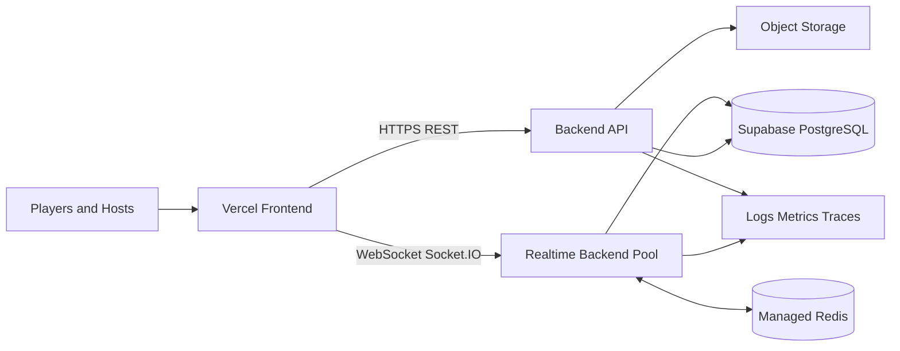

# The Word Impostor: Thousands-of-Users Implementation Plan

## Purpose and decision

This document defines the migration path from the current single-process Node.js, Socket.IO, and local SQLite game to a multi-service architecture that can support **thousands of concurrent users across many rooms**. It preserves the existing game rules, real-time behaviour, privacy vault, Ghost logic, voting, scoring, and host controls. This is a **plan only**; it does not authorize a production migration until the required service accounts, domains, and secrets are available.

The recommended deployment is a JavaScript monorepo with a Vercel-hosted React frontend, a separately deployed persistent Socket.IO backend, Supabase PostgreSQL for durable state, and managed Redis for distributed real-time coordination. Vercel can serve WebSockets, but each connection is pinned to a function instance and has a maximum-duration lifecycle; for a long-lived, high-concurrency party-game server, a dedicated container service provides clearer capacity controls and operational behaviour. [1]

| Current constraint | Scaled replacement | Why it changes |
|---|---|---|
| Single Node.js process | Multiple stateless backend instances | Removes the one-server concurrency ceiling and enables rolling deploys. |
| In-process Socket.IO rooms | Socket.IO Redis adapter plus shared room state | Allows broadcasts to reach players connected to different backend instances. [2] |
| Local SQLite database | Supabase PostgreSQL | Provides managed, durable, remotely accessible transactional storage. |
| Local word-pack uploads | Managed object storage plus database metadata | Keeps uploads available to every backend instance. |
| Password-only local sessions | Signed, short-lived server-issued session tokens | Reduces impersonation and supports consistent reconnects across instances. |

## Target architecture



The frontend is independently deployable and contains only React, UI assets, public environment values, and generated static files. The backend is independently deployable and owns every authoritative operation: joining a room, readiness, role allocation, clues, discussion, votes, eliminations, scoring, host recovery, player leave, and session cleanup.

Redis is not the permanent record. PostgreSQL remains the source of truth for all game events and durable records. Redis holds short-lived room snapshots, presence, locks, rate-limit counters, idempotency keys, and Socket.IO adapter communication. The standard Socket.IO Redis adapter forwards room broadcasts between servers using Redis Pub/Sub; its documentation also requires sticky sessions for HTTP transport compatibility and recommends protecting Redis with private networking, TLS, authentication, and ACLs. [2]

## Required repository structure

The application should be reorganized without changing JavaScript/JSX to the following structure.

```text
word-impostor/
├── frontend/
│   ├── src/                    # React JSX, views, components, CSS, client tests
│   ├── public/
│   ├── index.html
│   ├── vite.config.js
│   └── package.json
├── backend/
│   ├── src/
│   │   ├── api/                # REST health, configuration, admin endpoints
│   │   ├── realtime/           # Socket.IO server, rooms, authentication, adapters
│   │   ├── game/               # Authoritative rules and game services
│   │   ├── db/                 # PostgreSQL repositories and migrations
│   │   ├── cache/              # Redis cache, locks, rate limits, idempotency
│   │   └── storage/            # Word-pack upload metadata and object storage
│   ├── data/category-packs/    # Six built-in JSON packs
│   ├── migrations/             # Versioned PostgreSQL SQL migrations
│   └── package.json
├── packages/
│   └── shared/                 # JavaScript event names, validators, role and word IDs
├── tests/
│   ├── integration/
│   ├── load/
│   └── e2e/
├── infra/                      # Deployment manifests, environment templates, CI files
├── package.json                # Workspace commands only
└── README.md
```

The new `packages/shared/` directory must contain protocol constants and validation rules shared by browser and server. It must contain no database credentials and no private role data. All existing JSX and JavaScript remain JavaScript and JSX; no TypeScript conversion is required.

## Backend and database changes

### 1. Replace SQLite with PostgreSQL

Create versioned PostgreSQL migrations for rooms, players, rounds, enabled room packs, used words, clues, votes, discussion messages, scores, events, memorable clues, alerts, and migration metadata. Preserve stable word-entry IDs in the form `packId:entryId` so the existing category-pack history remains compatible.

The database migration must add the following production-grade fields:

| Record | New fields or constraints | Purpose |
|---|---|---|
| `rooms` | `state_version`, `expires_at`, `created_at`, `updated_at` | Optimistic concurrency and cleanup. |
| `players` | `session_token_hash`, `last_seen_at`, `left_at`, unique `(room_id, normalized_user_id)` | Safe reconnect and duplicate-name control. |
| `votes` and `hints` | `request_id`, unique action constraint | Idempotent retries cannot submit two actions. |
| `room_events` | monotonic sequence number | Reliable replay after reconnect. |
| `room_passwords` or room field | Argon2id/bcrypt password hash and migration version | Never retain plaintext room passwords. |
| `custom_word_packs` | storage key, owner, checksum, moderation state | Shared access without local-disk dependency. |

Use a PostgreSQL transaction for any rule-changing action. For each action, either lock the relevant room row (`SELECT ... FOR UPDATE`) or issue a conditional `UPDATE` using `state_version`. A vote, clue, next-turn action, player departure, or Continue transition must verify the expected room state before changing it. This prevents concurrent Socket.IO instances from resolving the same vote or turn twice.

Use the appropriate Supabase connection strategy for the backend’s hosting model. Supabase recommends direct connections for long-lived backends when reachable, session pooling for persistent IPv4-only backends, and transaction pooling for serverless or edge workloads. [3]

### 2. Introduce repositories and a cache boundary

Replace direct SQL calls inside game services with narrow repositories such as `roomsRepository`, `playersRepository`, `roundsRepository`, `votesRepository`, and `eventsRepository`. Add `roomStateCache` and `presenceCache` abstractions so the game service does not know whether it is using Redis or PostgreSQL.

Room snapshots should be cached with an explicit TTL and invalidated or repopulated after every committed state change. A reconnect must always be able to rebuild a correct snapshot from PostgreSQL if the cache is empty. No correctness decision may depend only on Redis.

### 3. Make all actions idempotent

The frontend must generate a `requestId` for every mutating request. The backend stores the outcome for that `(roomId, playerId, requestId)` combination. If a phone retries after packet loss, it receives the original result rather than a second clue, second vote, duplicate chat message, or duplicate departure.

## Realtime and horizontal-scaling changes

### 1. Separate REST and Socket.IO concerns

Run one backend image containing both the REST health/configuration API and Socket.IO server, but organize the code as distinct modules. Health checks must not query a full room snapshot. Readiness checks must confirm database and Redis connectivity separately.

Configure CORS using an allow-list of the Vercel production domain, preview domains where needed, and approved local development origins. Do not use an unrestricted production CORS policy.

### 2. Add Redis-backed Socket.IO scaling

Install `redis` or `ioredis` and `@socket.io/redis-adapter`; create separate publisher and subscriber connections, then attach the adapter before opening the server. Begin with a managed single-primary Redis service, and adopt Redis Cluster/sharded Pub/Sub only after measured adapter traffic requires it. Socket.IO notes that a Redis failure limits broadcasts to clients connected to the current server, so health checks and degraded-mode alerts are required. [2]

Use a trusted private Redis network, TLS, authentication, ACLs, and a dedicated namespace. Never expose Redis directly to browsers. [2]

### 3. Move ephemeral state out of memory

The following current in-memory concepts must be represented in Redis or PostgreSQL:

| State | Store | Expiry / recovery rule |
|---|---|---|
| Socket presence and last heartbeat | Redis | Expire automatically after a short missed-heartbeat window. |
| Host reconnect grace deadline | Redis and PostgreSQL event | Any backend instance can resume or enforce expiry. |
| Room distributed lock | Redis | Short TTL; renew only while the action transaction runs. |
| Rate-limit buckets | Redis | Expire by action window. |
| Current room snapshot | Redis cache | Rebuild from PostgreSQL when missing or version mismatch occurs. |
| Votes, clues, score, rules, pack history | PostgreSQL | Durable source of truth. |

### 4. Reconnect and event replay protocol

Each snapshot and event needs `roomVersion` and `eventSequence`. On reconnect, the client sends its last event sequence. The backend returns missing events if available; otherwise it returns a complete authoritative snapshot. This avoids stale UI state after a region failover, deploy, backend restart, or mobile network switch.

## Frontend changes

The React UI remains visually unchanged, but networking must be decoupled from a same-origin local server.

| Change | Implementation |
|---|---|
| API base URL | Use `VITE_API_BASE_URL` for REST requests. |
| Socket URL | Use `VITE_SOCKET_URL` and an explicit WebSocket-only Socket.IO transport. |
| Session protocol | Store only a short-lived, signed session token; avoid storing room passwords after successful join where practical. |
| Action requests | Attach `requestId`, expected `roomVersion`, and acknowledgement handling to each mutation. |
| Reconnect UX | Show a small reconnecting state, then request event replay or a full snapshot. |
| Error UX | Distinguish invalid action, stale state, throttling, room ended, and retryable network errors. |
| Payload control | Render incremental events where possible; avoid broadcasting an oversized full snapshot after every small chat message in large rooms. |

For rooms approaching 100 participants, use message virtualization, a capped visible activity history, and compact presence lists. Keep the party-game experience suited to smaller active tables; thousands of users should normally mean many simultaneous rooms, not thousands of active clue-givers in one room.

## Authentication, abuse prevention, and privacy

The current room password is suitable for a casual local game but not as the only public-internet protection. Add the following before public launch:

| Control | Required change |
|---|---|
| Room-password storage | Hash room passwords with Argon2id or bcrypt; verify only on the backend. |
| Session token | Issue signed, short-lived tokens with rotation on join/reconnect. |
| Rate limits | Join, room creation, hint, chat, vote, upload, and host-control limits in Redis. |
| Input validation | Schema validation, normalisation, length limits, and payload-size limits before any database write. |
| Upload protection | Validate JSON schema, word count, file size, checksum, and ownership; store files outside the application container. |
| Abuse response | Per-IP/device throttling, temporary room lock, host moderation controls, and structured audit events. |
| Secrets | Store all database, Redis, signing, and storage credentials only in backend deployment secrets. |
| Data access | Keep Supabase service credentials exclusively on the backend; expose only intentionally public frontend variables. |

## Deployment design

### Recommended production topology

| Component | Initial production configuration | Scale-out trigger |
|---|---|---|
| Frontend | Vercel deployment connected to `frontend/` | CDN handles static scale automatically. |
| Backend | Container platform with one always-on instance, health checks, graceful shutdown, and WebSocket support | Add instances after measured CPU, memory, connection, or latency pressure. |
| Redis | Managed Redis with TLS and private connectivity | Increase capacity or cluster after measured memory or Pub/Sub pressure. |
| PostgreSQL | Supabase project in the same geographic region as backend | Upgrade compute, pool connections, then consider read replicas for analytics workloads. |
| Storage | Managed object storage for custom packs | Lifecycle policy and scanning if uploads grow. |
| Monitoring | Central error tracking, metrics, logs, traces, uptime probes | Alert on threshold breach before users report it. |

Vercel’s current WebSocket documentation notes that reconnects may land on a different function instance and recommends external state for rooms, presence, counters, and coordination. [1] This reinforces the PostgreSQL-plus-Redis design regardless of whether the realtime backend is ultimately hosted on Vercel Functions or on a dedicated container platform.

### Environment variables

```text
# frontend/.env.production
VITE_API_BASE_URL=https://api.example.com
VITE_SOCKET_URL=https://api.example.com
VITE_APP_ENV=production

# backend/.env.production
NODE_ENV=production
PORT=<platform-provided>
CORS_ORIGINS=https://www.example.com,https://example.com
DATABASE_URL=<supabase pooled or direct postgres URL>
REDIS_URL=<managed redis TLS URL>
SESSION_SIGNING_SECRET=<random secret>
ROOM_PASSWORD_PEPPER=<random secret>
SUPABASE_URL=<backend only>
SUPABASE_SERVICE_ROLE_KEY=<backend only>
OBJECT_STORAGE_BUCKET=<bucket name>
SENTRY_DSN=<server error monitoring>
```

## Migration workstreams

### Workstream A — Monorepo separation

1. Move the existing React application into `frontend/`.
2. Move the Express, Socket.IO, game engine, category files, and server scripts into `backend/`.
3. Move protocol and role helper modules into `packages/shared/`.
4. Replace relative cross-boundary imports with workspace package imports.
5. Keep a root `npm run dev`, `npm test`, `npm run build`, and `npm run verify` command.
6. Run the unchanged test suite after every move; this workstream must not alter gameplay.

### Workstream B — PostgreSQL and data migration

1. Translate SQLite schema into versioned PostgreSQL SQL migrations.
2. Create seed migrations for the six built-in category packs.
3. Build repository interfaces with PostgreSQL implementations.
4. Create a one-time SQLite-to-PostgreSQL export/import tool for retained local data; do not migrate active in-progress rooms during the cutover.
5. Run dual-read verification against a test data copy, compare room snapshots, then switch runtime writes to PostgreSQL.
6. Retire SQLite only after backup validation and a rollback window.

### Workstream C — Redis and distributed Socket.IO

1. Create Redis connections, health probes, rate-limit helpers, locks, and key naming rules.
2. Add the Socket.IO Redis adapter and keep Socket.IO on WebSocket transport.
3. Add a load-balancer sticky-session configuration if the chosen infrastructure requires it; Socket.IO’s Redis adapter documentation states that sticky sessions remain necessary. [2]
4. Move host grace deadlines, presence, and cacheable snapshots from process memory.
5. Add graceful shutdown: stop new sockets, notify clients, finish active requests, and disconnect cleanly.

### Workstream D — Public API and client protocol

1. Version the Socket.IO event contract and define JSON payload schemas.
2. Add signed token verification to Socket.IO middleware.
3. Add action request IDs and optimistic concurrency versions.
4. Add reconnect replay and snapshot fallback.
5. Configure `VITE_API_BASE_URL` and `VITE_SOCKET_URL`; remove hard-coded local assumptions.

### Workstream E — Security and operations

1. Hash room passwords and rotate session tokens.
2. Add Redis rate limits and upload safeguards.
3. Add structured logs with request, room, and socket correlation IDs.
4. Add metrics for connected sockets, active rooms, event latency, Redis health, database pool saturation, failed joins, and rate-limit blocks.
5. Add database backups, restore drills, incident runbooks, and production-secret rotation guidance.

## Validation and load-testing gates

Do not set a user-count claim before testing the actual deployed configuration. Establish explicit targets with the product owner, then execute these gates in a staging environment.

| Gate | Test | Pass condition |
|---|---|---|
| Correctness | Existing unit and flow checks | All game, privacy, voting, reconnect, Ghost, and Continue regressions pass. |
| Database | PostgreSQL transactional race tests | No duplicate votes, clues, score events, or turn transitions under concurrent calls. |
| Multi-node realtime | Two or more backend instances plus Redis | A player on any instance receives each room event exactly once or deduplicates by event ID. |
| Recovery | Kill one backend instance during play | Clients reconnect, replay or resync, and no committed event is lost. |
| Load | Artillery or k6 WebSocket scenarios | Meet agreed connection, event-latency, CPU, memory, and error-rate targets. |
| Abuse | Rate-limit and malformed-payload tests | Invalid traffic is rejected without exhausting backend or database capacity. |
| Rollback | Production-like deploy rollback | Previous backend and schema-compatible frontend resume safely. |

Load scenarios must include many small rooms, burst room creation, simultaneous clue submissions, voting completion, reconnect storms after an instance restart, and large spectator audiences. Test public-vote and chat broadcasts separately because their message volume differs.

## Phased rollout

| Phase | Scope | Exit criteria |
|---|---|---|
| 0. Baseline | Freeze current rules; capture tests, build, and SQLite backup. | Current production and local flows are reproducible. |
| 1. Structure | Create `frontend/`, `backend/`, and `packages/shared/`; no behaviour change. | Existing tests and build pass from new layout. |
| 2. Data | Introduce PostgreSQL schema, repositories, migrations, and data import. | Snapshot parity and transactional race tests pass. |
| 3. Single-node cloud | Deploy one backend instance, Supabase, and Vercel frontend. | Real public rooms work with correct reconnect and cleanup. |
| 4. Distributed realtime | Add Redis, adapter, externalized ephemeral state, and multi-instance staging. | Cross-instance rooms and failure recovery pass. |
| 5. Hardening | Add rate limits, monitoring, backups, CI, and load tests. | Capacity targets and error budgets are met. |
| 6. Scale-out | Controlled public rollout, autoscaling, and operational review. | Observed usage is stable before increasing limits. |

## What must not change accidentally

The migration must preserve the following tested game behaviour: Host1234 host flow; room password joining; two clue cycles before the first vote; one clue cycle after subsequent ballots; private role vault; all-player clue visibility; duplicate clue prevention; public live voting; two-elimination cap; tie/revote rules; Ghost mode; Continue restoration; host recovery grace period; explicit leave; role-safe snapshots; pack-scoped no-repeat words; six built-in category packs; custom pack validation; score reasons; discussion cooldown/lock; and room cleanup.

## Pre-deployment feature workstreams requested by the product owner

The following workstreams are now **prerequisites to the production architecture migration**. They should be implemented and fully regression-tested while the current single-process architecture remains available as a stable reference. None should be merged as a visual-only change: each needs an authoritative backend rule, persistent data model, Socket.IO event contract, client state update, and test coverage.

### A. Word lifecycle and reuse policy

The required rule is now: **a word must not repeat during the same round, but the correct reuse policy after Continue depends on whether Continue means a new round or a new game session.** The user indicated that words currently reset after Continue; this must be corrected only after the intended policy is confirmed.

The recommended policy is to preserve the existing pack-scoped `used_word_entries` history for the whole room session. Continue with the same players starts a new round but does **not** clear this history. Restart/new session explicitly clears it. This avoids repeated words across a multi-round game while still allowing the full pack to be used again after a genuine restart.

| Required change | Backend and data rule | Client effect |
|---|---|---|
| Same-round prevention | Keep the existing chosen word immutable for the active round. | No second word selection can overwrite an active round. |
| Continue behaviour | Do not delete `used_word_entries` on Continue. | Host sees only remaining eligible words. |
| New-session reset | Clear used-word history only on the explicit Restart/New Game flow or new room. | New session begins with the full selected pack pool. |
| Scaled persistence | Store used entries with `(room_id, pack_id, word_entry_id)` unique constraint. | Reconnects and multi-node servers use the same no-repeat source of truth. |

### B. Cumulative score ledger and end-of-round layout

Scores must become a **room-session cumulative ledger**. A player’s totals carry through every completed round and reset only when the host closes/terminates the room or starts a deliberately fresh session. The activity panel should no longer be the primary score presentation.

The recommended UI is a dedicated **Round Results** screen/card immediately after every reveal and vote resolution. It should present the round outcome first, then a compact leaderboard with each player’s total, that round’s point change, and a reason label. The persistent room activity panel may retain a non-intrusive “Score history” tab for auditability, but it must not be the main score surface.

| Required change | Backend and data rule | Client effect |
|---|---|---|
| Cumulative totals | Do not delete `player_scores` during Continue; create a new ledger row for every point change. | Leaderboard totals grow across rounds. |
| Per-round changes | Add `round_id` and a stable reason code to every score event. | Results show `+2 this round` beside a cumulative total. |
| Round results | Snapshot the resolved round before starting the next lobby. | Clear, full-screen result presentation instead of chat-panel dependence. |
| Session reset | Delete/close score ledger only during End Room or explicit fresh session. | The host can explain precisely when totals reset. |

### C. Direct one-to-one messaging beside group discussion

Direct messages need a separate privacy model from room-wide discussion. Each message must have a sender, exactly one recipient, a room ID, timestamp, moderation/deletion state, and optional read state. The recipient and sender may see it; the host must **not** automatically see message content unless the user explicitly chooses a moderation model that permits it.

The recommended client layout is one compact activity drawer with two tabs: **Table Discussion** and **Direct Messages**. The direct-message tab includes a recipient selector limited to active players and an unread-count badge. Ghosts should be read-only by default unless the product owner explicitly permits them to send messages.

| Required change | Backend and data rule | Client effect |
|---|---|---|
| Message privacy | Add `direct_messages` with `(room_id, sender_id, recipient_id, content, created_at, deleted_at)`. | Only sender and recipient receive `directMessage` events. |
| Authorization | Verify both users belong to the room and are eligible before insertion. | No cross-room or spoofed direct messages. |
| Rate limits | Separate per-user direct-message cooldown and burst limit. | Prevents spam without blocking group discussion. |
| Moderation | Define whether hosts can delete metadata-only or content-bearing DMs before coding. | Makes privacy behaviour explicit. |
| Scaling | Fetch history by recipient pair and cursor; emit only to the two relevant sockets. | Avoids broadcasting private content to every socket. |

### D. Skip Vote / abstention choice

Add an explicit **Skip Vote** action to the voting UI. A skip is a recorded ballot choice, not a disconnected-player abstention. It must be visible in the public live vote feed only if the product owner wants all voting actions public; otherwise it may appear as a counted skip without exposing voter identity. The current project’s public voting rule suggests recording “Player skipped” visibly for consistency.

The recommended resolution rule is: skips count toward ballot completion, never add support to an elimination target, and do not by themselves eliminate anyone. If skips are the largest result or no target receives a decisive result, resolve as a documented **no-elimination/stalemate** outcome and move to the next clue cycle unless a win condition already applies.

| Edge case | Required decision and implementation |
|---|---|
| All players skip | Close the ballot as no elimination, publish a result card, then continue if no win condition applies. |
| Tie with skip | Define whether skip participates in tie comparison; recommended: skip can prevent elimination but cannot trigger multi-player elimination. |
| Disconnected player | Keep host-issued abstention separate from intentional skip for audit clarity. |
| Re-vote | Carry only eligible active players; reset the skip choice for the new ballot. |
| Scoring | No automatic points for skip unless the scoring model explicitly defines them. |

### E. Professional Create Room / Join Room / Host-as-player entry flow

Replace the Host1234-only entry convention with two explicit entry paths: **Create Room** and **Join Room**. The person creating the room receives a host credential and a player identity. They can switch between host moderation mode and player view without opening a second account or leaking host-only information.

The host-player mode switch must be a client presentation and authorization boundary, not a duplicate player. The creator owns a normal active player row, plus a separate host control credential. In Host mode, private moderation controls are visible; in Player mode, the same person receives only the player-safe role view and participates in readiness, clues, voting, and results. The server must never infer permissions from a browser toggle alone.

| Entry flow | Required backend change | Required frontend change |
|---|---|---|
| Create Room | Create room, hashed password, host credential, and creator player record atomically. | Professional form: display name, room name/code preference, password, game settings. |
| Join Room | Verify room ID and password, then issue player session token. | Professional join form with clear validation and Ghost late-join option. |
| Host as player | Bind host token and player token to one creator identity, with separate capabilities. | Top-bar Host/Player switch that changes view, never credentials. |
| Host privacy | Host Player mode never receives host peek data by default. | Clearly label mode and provide a return-to-host control. |
| Recovery | Recover host controls only after host credential verification; recover player independently with player token. | Avoids accidental host privilege escalation. |

### Cross-feature implementation order

1. Finalize policy decisions marked as required in this section, especially word reset, direct-message moderation, skip-tie handling, and host-player privacy.
2. Add database/schema changes and service-layer models first.
3. Implement Socket.IO events and authorization with unit/integration tests.
4. Build client components and responsive layouts.
5. Run existing regressions plus new scenario tests for every cross-feature rule.
6. Only then begin the frontend/backend split and PostgreSQL/Redis production migration described in the main plan.

## Required decisions before implementation starts

| Decision | Owner | Why it is required |
|---|---|---|
| Production domain and regions | Product owner | Frontend, backend, database, and Redis should be geographically aligned. |
| Backend platform | Product owner | Determines Docker, networking, sticky-session, scaling, and cost configuration. |
| Supabase project and paid-tier budget | Product owner | Required for production database capacity, backups, and connection limits. |
| Redis provider and budget | Product owner | Required before multi-instance Socket.IO deployment. |
| Target room size and total concurrent users | Product owner | Determines UI limits, rate limits, load scenarios, and capacity goals. |
| Authentication policy | Product owner | Determines whether room password remains sufficient or accounts are introduced. |
| Data retention policy | Product owner | Defines cleanup jobs, backups, event history, and privacy obligations. |

## References

[1]: https://vercel.com/docs/functions/websockets "Vercel: WebSockets"
[2]: https://socket.io/docs/v4/redis-adapter/ "Socket.IO: Redis adapter"
[3]: https://supabase.com/docs/guides/database/connecting-to-postgres "Supabase: Connect to your database"
